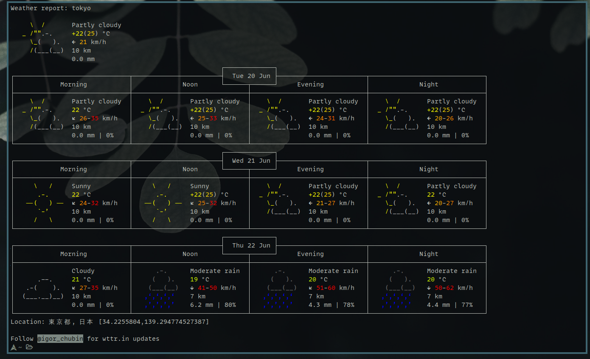

# my-st

My personal patched st



## Version

Based on st-0.8.5

## Patch List

The dependency package names are for arch-based distributions.

If you are not, the name may be different.

| Patch                          | Version  | Dependencies |
| ------------------------------ | -------- | ------------ |
| st-alpha                       | 0.8.5    | -            |
| st-anysize                     | 0.8.4    | -            |
| st-blinking_cursor             | 20211116 | -            |
| st-bold-is-not-bright          | 20190127 | -            |
| st-boxdraw                     | v2-0.8.5 | -            |
| st-charoffsets                 | 20220311 | -            |
| st-desktopentry                | 0.8.5    | -            |
| st-dont-cut-text               | -        | -            |
| st-dynamic-cursor-color        | 0.9      | -            |
| st-externalpipe                | 0.8.4    | -            |
| st-font2                       | 0.8.5    | -            |
| st-glyph-wide-suppor-boxdraw   | 20220411 | -            |
| st-ligatures-boxdraw           | 20210824 | -            |
| st-netwmicon                   | 0.8.5    | -            |
| st-undercurl                   | 0.8.4    | -            |
| st-scrollback                  | 0.8.5    | -            |
| st-xresources                  | 20200604 | -            |
| st-xresources-signal-reloading | 20220407 | -            |

## Installation

build and install：

```
git clone https://github.com/MiuKaShi/miuka-st.git
cd miuka-st
make
sudo make clean install
```
